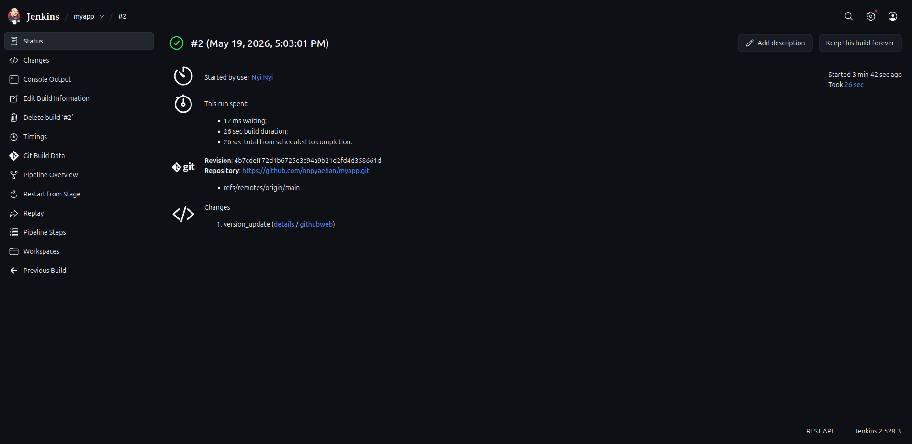
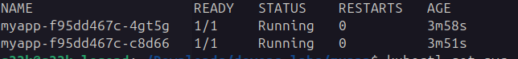
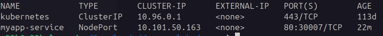

# DevOps CI/CD Pipeline with Jenkins + Kubernetes

This project demonstrates a complete CI/CD pipeline using:

- Jenkins
- Docker
- Kubernetes (Minikube)
- Docker Hub
- GitHub

---

# Architecture

```
GitHub → Jenkins → Docker → Docker Hub → Kubernetes
```

---

# Technologies Used

- Jenkins
- Docker
- Kubernetes
- Minikube
- GitHub

---

# Jenkins Pipeline Success



---

# Kubernetes Pods



---

# Kubernetes Service



---

# How to Run

## Build Docker Image

```bash
docker build -t myapp:v1 .
```

## Push Image

```bash
docker push yourdockerhub/myapp:v1
```

## Deploy to Kubernetes

```bash
kubectl apply -f k8s/
```

---

# CI/CD Flow

1. Push code to GitHub
2. Jenkins detects changes
3. Docker image builds
4. Image pushed to Docker Hub
5. Kubernetes deployment updated